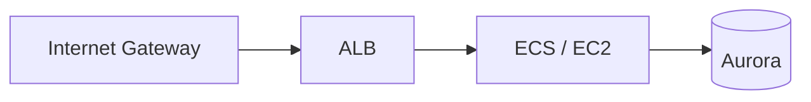

# InfraTales | AWS CDK VPC Multi-Environment CIDR Design Without Overlap or SSM Lookups

**AWS CDK (TYPESCRIPT) reference architecture — networking pillar | intermediate level**

> Every team eventually hits the moment where dev, staging, and prod share the same VPC CIDR range — and then someone tries to peer them, or connect a VPN, and everything breaks. This CDK project solves the environment-isolation problem by encoding per-environment CIDR blocks (10.0.0.0/16 for dev, 10.1.0.0/16 for staging, 10.2.0.0/16 for prod) directly into the stack logic, so network collisions become a deploy-time impossibility rather than a 2am incident. The IaC approach means the same stack definition deploys correctly to every environment without manual subnet bookkeeping.

[](LICENSE)
[](CONTRIBUTING.md)
[](https://aws.amazon.com/)
[-IaC-purple.svg)](https://aws.amazon.com/cdk/)
[](https://infratales.com/p/effd49f8-1b10-487a-b1a3-2140b22d4153/)
[](https://infratales.com)


## 📋 Table of Contents

- [Overview](#-overview)
- [Architecture](#-architecture)
- [Key Design Decisions](#-key-design-decisions)
- [Getting Started](#-getting-started)
- [Deployment](#-deployment)
- [Docs](#-docs)
- [Full Guide](#-full-guide-on-infratales)
- [License](#-license)

---

## 🎯 Overview

The core construct is a CDK TypeScript stack (TapStack) that provisions a VPC with two subnets per environment, selecting non-overlapping CIDR ranges based on an environment suffix passed at synthesis time. [from-code] The CIDR selection logic lives in a static method inside TapStack, making the mapping auditable and testable without touching AWS. [from-code] What is non-obvious here is the decision to encode network topology as pure TypeScript logic rather than CDK context variables or SSM parameters, which eliminates an entire class of cross-environment lookup failures at the cost of making CIDR changes a code change. [inferred]

**Pillar:** NETWORKING — part of the [InfraTales AWS Reference Architecture series](https://infratales.com).
**Target audience:** intermediate cloud and DevOps engineers building production AWS infrastructure.

---

## 🏗️ Architecture



> Architecture diagrams in [`diagrams/`](diagrams/) show the full service topology (architecture, sequence, and data flow).
> The [`docs/architecture.md`](docs/architecture.md) file covers component responsibilities and data flow.

---

## 🔑 Key Design Decisions

- Hardcoding CIDRs in TypeScript means any network expansion (e.g. adding a /16 for a DR region) requires a code change, PR review, and redeployment — but it also means the CIDR map is version-controlled and diffable, unlike SSM-stored values that can drift silently. [from-code]
- Two subnets per environment is a minimal footprint that avoids NAT Gateway costs in dev/staging but gives you no AZ redundancy on those tiers — a subnet failure in dev will kill CI pipelines. [inferred]
- Using a single CDK stack for all environment variants keeps the blast radius of a misconfigured synth to one account/region, but it also means you cannot isolate prod deployment permissions from staging at the CDK app level without additional stack splitting. [inferred]
- Static CIDR method in TapStack is unit-testable (npm run test:unit), which is a real operational win — most teams only discover CIDR conflicts after a VPC peer fails in prod, not in a test run. [from-code]

> For the full reasoning behind each decision — cost models, alternatives considered, and what breaks at scale — see the **[Full Guide on InfraTales](https://infratales.com/p/effd49f8-1b10-487a-b1a3-2140b22d4153/)**.

---

## 🚀 Getting Started

### Prerequisites

```bash
node >= 18
npm >= 9
aws-cdk >= 2.x
AWS CLI configured with appropriate permissions
```

### Install

```bash
git clone https://github.com/InfraTales/<repo-name>.git
cd <repo-name>
npm install
```

### Bootstrap (first time per account/region)

```bash
cdk bootstrap aws://YOUR_ACCOUNT_ID/YOUR_REGION
```

---

## 📦 Deployment

```bash
# Review what will be created
cdk diff --context env=dev

# Deploy to dev
cdk deploy --context env=dev

# Deploy to production (requires broadening approval)
cdk deploy --context env=prod --require-approval broadening
```

> ⚠️ Always run `cdk diff` before deploying to production. Review all IAM and security group changes.

---

## 📂 Docs

| Document | Description |
|---|---|
| [Architecture](docs/architecture.md) | System design, component responsibilities, data flow |
| [Runbook](docs/runbook.md) | Operational runbook for on-call engineers |
| [Cost Model](docs/cost.md) | Cost breakdown by component and environment (₹) |
| [Security](docs/security.md) | Security controls, IAM boundaries, compliance notes |
| [Troubleshooting](docs/troubleshooting.md) | Common issues and fixes |

---

## 📖 Full Guide on InfraTales

This repo contains **sanitized reference code**. The full production guide covers:

- Complete AWS CDK (TYPESCRIPT) stack walkthrough with annotated code
- Step-by-step deployment sequence with validation checkpoints
- Edge cases and failure modes — what breaks in production and why
- Cost breakdown by component and environment
- Alternatives considered and the exact reasons they were ruled out
- Post-deploy validation checklist

**→ [Read the Full Production Guide on InfraTales](https://infratales.com/p/effd49f8-1b10-487a-b1a3-2140b22d4153/)**

---

## 🤝 Contributing

See [CONTRIBUTING.md](CONTRIBUTING.md) for guidelines. Issues and PRs welcome.

## 🔒 Security

See [SECURITY.md](SECURITY.md) for our security policy and how to report vulnerabilities responsibly.

## 📄 License

See [LICENSE](LICENSE) for terms. Source code is provided for reference and learning.

---

<p align="center">
  Built by <a href="https://www.rahulladumor.com">Rahul Ladumor</a> | <a href="https://infratales.com">InfraTales</a> — Production AWS Architecture for Engineers Who Build Real Systems
</p>
